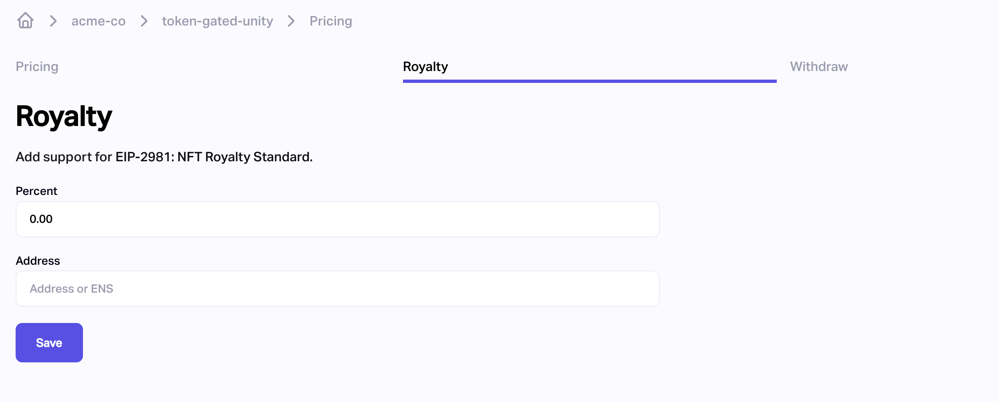

# CLI Quick Start

The Valist CLI allows you to easily publish, download, and install releases from the command line! It's a great way to easily work with releases without navigating through a frontend. You can also use it to integrate your existing CI/CD workflows.

### Features

The Valist CLI supports all of the core functionality of Valist, including:

* Secure key management with [keytar](https://www.npmjs.com/package/keytar)
* Publishing releases, for example `valist publish acme-co/go-binary/0.0.1 dist/*`
* Downloading releases, for example `valist download acme-co/go-binary`
* Gasless meta-transactions powered by [OpenGSN](https://github.com/opengsn/gsn)

### Installation

To install the CLI, you will need Node.js v16+ installed.

```bash
npm install -g @valist/cli
```

### Create an account & project

To publish with the CLI, you first need to create an account & project at the [Web Dashboard](https://app.valist.io).

For more information, visit:


[creating-an-account.md](../web/publishing-releases/creating-an-account.md)



[creating-a-project.md](../videos/creating-a-project.md)


### Generating or importing a key in the CLI wallet

**Generating a fresh key (recommended, most secure method)**

The most recommended configuration is to generate a fresh key in the CLI, then add that address to the designated account or project you wish to publish to.

To generate a new key and store it directly into your secure keystore, run the following:

```
valist keygen
```

This will print out an address like so:



Next, you will need to add this key to your desired project or account members to give it access to publish. Navigate to your project or account settings in the web dashboard, and add the key like so:

.png>)


This step is required before the CLI can publish under the account or project.


**Importing a Key (easiest, less secure)**

The Valist CLI also supports importing the following key formats:

* Private Key Hex string
* Encrypted JSON Keystore (MyCrypto, Geth, etc)
* Mnemonic phrase

To import your key into your secure keystore, run the following:

```bash
valist import
```

This will prompt you to import the key into your system's secure credential storage. You will then be able to use this key for publishing.


Your key is only accessible by you -- this simply copies your key into your system's native secure keystore.


### Publishing a Release

Publishing a Release with the CLI is very simple. You simply need to give it the `account/project/tag` path to publish at, and the set of files to include in the Release.

The format is the following:

```bash
valist publish <username>/<project>/<version> <folder>/**
```

An example of this looks like:

```
valist publish acme-co/go-binary/0.0.1 dist/**
```

You can also include multiple folders and files. The file paths support [glob patterns](https://github.com/sindresorhus/globby) as well:

```bash
valist publish acme-co/go-binary/0.0.2 dist/** src/** README.md
```

This will upload the files to IPFS, and trigger the publish. Meta-transactions are enabled by default, so you won't need to spend any gas.

This is a flexible and simple way to publish in any environment that supports Node.js!

### Downloading a Release

Downloading a Release with the CLI is just as easy.

Simply provide the release path, and it will download a `.tar` bundle containing the Release:

```bash
valist download acme-co/go-binary/0.0.1
```

If you don't specify a tag, the CLI will automatically download the latest Release:

```bash
valist download acme-co/go-binary
```

Voila! This will fetch the Release metadata and the corresponding artifacts from IPFS into your working directory.

